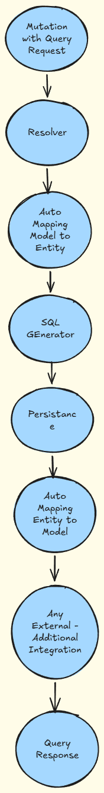

# GraphQL Coffee Beanery

## Overview

Coffee Beanery is a high-performance GraphQL-to-SQL execution engine for .NET that transforms GraphQL query trees into optimized SQL statements executed directly by PostgreSQL.

Unlike traditional GraphQL implementations that resolve fields individually, Coffee Beanery analyzes the entire GraphQL query structure, generates an optimized execution plan, and delegates execution to the database engine. This approach eliminates common GraphQL performance bottlenecks, reduces database round trips, and enables PostgreSQL to optimize joins, filtering, sorting, pagination, and execution plans.

Coffee Beanery is designed for database-first architectures where performance, scalability, and complex relationship traversal are essential.

---

## Why Coffee Beanery?

Most GraphQL frameworks rely on resolver chains and DataLoaders to mitigate N+1 query issues.

Coffee Beanery takes a fundamentally different approach by generating a complete SQL execution plan from the GraphQL Abstract Syntax Tree (AST) before any database interaction occurs.

### Benefits

- Eliminates resolver-per-field execution
- Removes the need for DataLoaders
- Reduces database round trips
- Centralizes query planning and optimization
- Leverages native PostgreSQL execution capabilities
- Provides predictable performance for deeply nested object graphs
- Generates SQL dynamically without requiring manual query definitions

---

## Key Capabilities

- Dynamic GraphQL-to-SQL translation
- Dapper-first architecture
- Runtime query planning
- Model-to-entity mapping engine
- Relationship-driven query generation
- Automatic SQL join construction
- One-to-one relationship support
- One-to-many relationship support
- Many-to-many relationship support
- Built-in pagination
- Built-in filtering
- Built-in sorting
- Batched SQL execution
- Alias-based graph traversal
- Extensible execution pipeline
- Custom business logic integration
- Query handler support
- PostgreSQL query optimization
- Automatic execution plan reuse through PostgreSQL caching

---

## Comparison

| Feature                   | Coffee Beanery   | Hot Chocolate | GraphQL.NET   |
| ------------------------- | ---------------- | ------------- | ------------- |
| Dapper First              | ✅ Yes            | ⚠️ Partial    | ⚠️ Partial    |
| GraphQL-to-SQL Generation | ✅ Yes            | ⚠️ Partial    | ❌ No          |
| Runtime Query Planning    | ✅ Yes            | ❌ No          | ❌ No          |
| Automatic Join Generation | ✅ Yes            | ❌ No          | ❌ No          |
| N+1 Elimination           | ✅ Database-Level | ⚠️ DataLoader | ⚠️ DataLoader |
| Source Customization      | ✅ Full           | ⚠️ Limited    | ⚠️ Limited    |
| PostgreSQL Optimization   | ✅ Yes            | ⚠️ Partial    | ❌ No          |

---

## Benchmarks

Tested with [Apidog](https://apidog.com) against a live PostgreSQL instance. No application-level caching — PostgreSQL built-in query cache only. All datasets use fully randomized UUID data.

The `Product` model in these tests spans **4 physical tables** across 3 schemas (`Banking`, `Lending`, `Account`). A single customer query generates 10 upsert statements and **1 SELECT** joining all 5 tables with 4 levels of nesting — resolved in a single database round trip. A resolver-chain architecture would require 5+ sequential round trips for the same graph.

### Single Customer — `eq` filter

5 datasets · 5 iterations · 10 assertions · **0 failures**

| Metric            | Value  |
|-------------------|--------|
| Avg Response Time | 13 ms  |
| Max Response Time | 67 ms  |
| Total Duration    | 239 ms |
| Pass Rate         | 100%   |

### Three Customers — `in` filter (batch)

5 datasets · 5 iterations · 30 assertions · **0 failures**

| Metric            | Value  |
|-------------------|--------|
| Avg Response Time | 16 ms  |
| Max Response Time | 78 ms  |
| Total Duration    | 239 ms |
| Pass Rate         | 100%   |

Scaling from 1 to 3 customers (3× entities, 3× upserts, 3× assertions) across a 4-table product graph added only **3 ms** to average response time. Total execution duration remained identical at **239 ms** — all entities resolved in one batched SQL statement regardless of entity count.

→ Full results, per-dataset breakdown, and generated SQL breakdown: [BENCHMARKS.md](./BENCHMARKS.md)

---

## Status

Coffee Beanery is actively under development. The current focus is integrating Apache AGE to provide native graph relationship support alongside relational query capabilities.

---

## Quick Start

### Clone the Repository

```
git clone https://github.com/CristianBarragan/GraphQL-Coffee-Beanery.git
```

### Apply Database Migrations

```
dotnet ef database update
```

### Run the Example Application

```
dotnet run
```

### Explore the API

Open Nitro or your preferred GraphQL IDE and execute queries and mutations against the configured endpoint.

---

## Technology Stack

Coffee Beanery is built using:

- Hot Chocolate
- Dapper
- PostgreSQL
- Entity Framework
- Apache AGE (In Progress)
- Citus (Planned)

---

## Customization

Coffee Beanery provides multiple extension points for adapting the framework to your business requirements.

### Supported Customizations

- Column-level security
- Table-level security
- Claims-based authorization
- Data validation
- Query caching strategies
- Result transformation pipelines
- Custom execution handlers
- Domain-specific query processing

---

## How It Works

### Execution Flow

[](./ProcessFlow.png)

1. A GraphQL query is parsed by Hot Chocolate.
2. Coffee Beanery converts the AST into an internal NodeTree representation.
3. Mapping sets resolve model-to-entity relationships.
4. The query planner generates optimized SQL statements.
5. PostgreSQL executes the generated SQL in batches.
6. Results are mapped back to domain entities and models.
7. Optional query handlers enrich or customize execution.
8. The GraphQL response is returned to the client.

### Result

This architecture avoids resolver chains, eliminates N+1 query patterns, and allows PostgreSQL to optimize execution plans, joins, and caching strategies.

---

## Core Concepts

### NodeTree

Represents the GraphQL query structure and serves as the foundation for query planning.

### NodeMap

Defines how domain models map to one or more database entities.

### FieldMap

Maps model properties to database columns and controls field-level translation.

### LinkKey

Defines relationships and join paths between entities.

### Mapping Sets

Provide context-aware mappings for a domain model.

#### Examples

- InnerCustomerMappingSet
- OuterCustomerMappingSet

Mapping sets allow the same domain model to behave differently depending on the execution context.

---

## Roadmap

### Current Features

- Runtime Query Planning
- SQL Generation Engine
- Mapping Engine
- Dapper Integration
- PostgreSQL Support

### In Progress

- Apache AGE Integration
- Native Graph Relationship Support

### Planned

- Citus Integration
- Distributed Query Planning
- Performance Analytics
- Advanced Query Diagnostics

---

## Contributing

Contributions, feedback, and collaboration are welcome.

### Ways to Contribute

- Feature requests
- Bug reports
- Performance improvements
- Documentation enhancements
- Architecture proposals
- New mapping strategies
- Testing improvements

Whether you're improving documentation or proposing major architectural changes, every contribution helps improve the project.

---

## Support

If Coffee Beanery helps your team build faster and more scalable GraphQL APIs, consider supporting the project.

[Buy me a Coffee ☕] *I would love a 100% colombian coffee!*

[](https://www.buymeacoffee.com/cristianbarragan)

---

## Keywords

GraphQL SQL Generator • GraphQL Query Planner • GraphQL Dapper • GraphQL PostgreSQL • GraphQL Database First • GraphQL Runtime SQL • GraphQL Query Optimization • GraphQL Performance • GraphQL N+1 Solution • GraphQL Execution Engine • GraphQL Relationship Mapping • GraphQL Join Generation • GraphQL AST Translation • High Performance GraphQL • Hot Chocolate Dapper • .NET GraphQL Framework • PostgreSQL GraphQL Framework

---

## AI Documentation

- [llms.txt](./llms.txt)
- [ai.seo.md](./ai.seo.md)